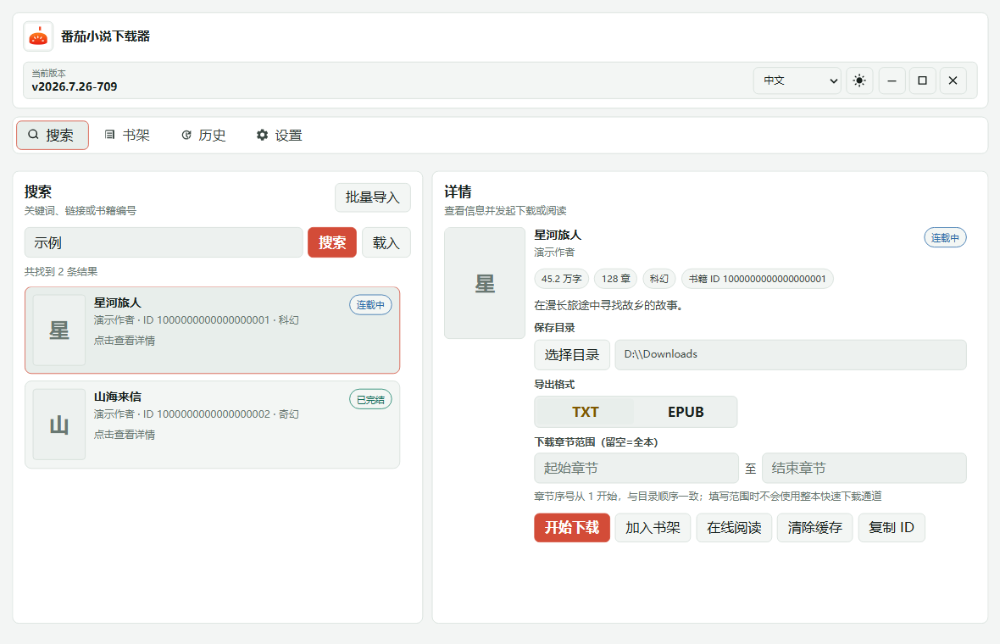
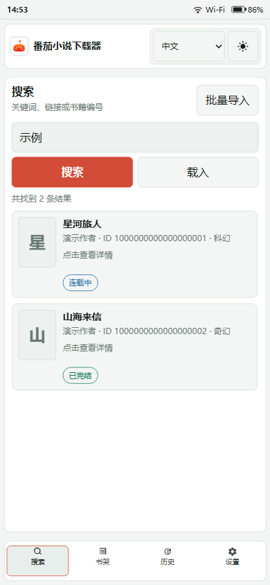

# 番茄小说下载器

基于 **Rust + Tauri v2** 的跨平台小说工具，提供搜索、书籍详情、在线阅读、书架管理，
以及 TXT / EPUB 下载。桌面端与移动端共用同一套前端和 Rust 后端，不依赖 Go sidecar。

[](https://github.com/POf-L/Fanqie-novel-Downloader/releases/latest)
[](https://github.com/POf-L/Fanqie-novel-Downloader/actions/workflows/ci.yml)

- [下载最新稳定版](https://github.com/POf-L/Fanqie-novel-Downloader/releases/latest)
- [查看全部版本](https://github.com/POf-L/Fanqie-novel-Downloader/releases)
- [提交问题或建议](https://github.com/POf-L/Fanqie-novel-Downloader/issues/new/choose)

## 界面预览

### 桌面端



### Android

<p align="center">
  
</p>

> 截图由当前界面代码生成。书名、作者和书籍 ID 均为演示数据，不对应真实作品。

## 主要功能

- 通过关键词、番茄小说链接或书籍 ID 搜索和直接载入书籍
- 查看封面、作者、分类、字数、状态、简介和章节目录
- 在线阅读、章节切换、阅读主题与字号调整、阅读进度记录，以及默认关闭的沉浸阅读模式
- 书架管理，点击书籍继续阅读或发起下载
- 单本下载与批量导入，支持指定章节范围
- 下载任务暂停、继续、取消，以及失败或缺失章节重试
- 导出 TXT / EPUB，保存下载历史并检查本地文件状态
- Windows、Linux 桌面端签名更新包与一键更新；Android、iOS 稳定版检查与下载提醒
- 浅色 / 深色主题，以及中文、English、Русский 界面
- Android 共享目录导出和系统阅读器打开；iOS 文件导出与系统分享

## 下载与平台支持

普通用户应优先从[最新稳定版](https://github.com/POf-L/Fanqie-novel-Downloader/releases/latest)
下载。每个 Release 的说明会列出实际附件、签名状态、安装限制和校验文件；没有发布的
平台或架构不要使用其他安装包代替。

| 平台 | 支持架构 | 普通用户选择 | 当前发布方式 |
| --- | --- | --- | --- |
| Windows | x64、ARM64 | `windows-*-setup.exe` | 稳定版；支持应用内更新 |
| Linux | x64、ARM64 | Debian / Ubuntu 选 `.deb`，其他发行版可选 `.AppImage` | 稳定版；支持应用内更新 |
| Android | arm64-v8a、armeabi-v7a、x86_64、universal | 优先 `arm64-v8a.apk`，不确定架构时选 `universal.apk` | 稳定版；应用内提示新版本；Android 7.0 / API 24 起 |
| macOS | Intel、Apple Silicon | 对应架构的 unsigned DMG；需要时再选 APP ZIP | 独立未签名 prerelease；不进入自动更新 |
| iOS | ARM64 | 无签名 IPA | 应用内提示新版本；需要自行侧载；不上架 App Store |

### Windows

大多数电脑选择 `x64`，Windows on ARM 设备选择 `ARM64`。当前安装程序尚未配置
Authenticode 发行商证书，因此 Windows 可能提示“未知发布者”或触发 SmartScreen；
这与 Tauri 自动更新包使用的更新签名不是同一套凭据。安装前请核对 Release 中的
SHA-256 校验清单。

### Linux

桌面壳依赖 **WebKitGTK 4.1**。AppImage 首次运行前需要授予执行权限：

```bash
chmod +x FanqieNovelDownloader-tauri-linux-*.AppImage
```

具体是否同时提供 DEB 与 AppImage，以对应 Release 的实际附件为准。

### Android

APK 可以直接安装；AAB 是应用商店上传产物，不能像 APK 一样直接打开安装。应用通过
Android 系统目录选择器保存 TXT / EPUB，并可交给已安装的阅读器打开。安装 APK 时需要
允许当前文件管理器或浏览器安装未知来源应用。

### macOS

在 Apple Developer ID 签名与公证凭据配置完成前，macOS 只通过
[Releases](https://github.com/POf-L/Fanqie-novel-Downloader/releases) 中标题含
“macOS 未签名版”的 prerelease 提供。Apple Silicon 选择 `arm64`，Intel 选择 `x64`，
通常优先下载 DMG。

首次启动被 Gatekeeper 拦截时，先核对 SHA-256，再前往“系统设置 → 隐私与安全性”选择
“仍要打开”。只有 Release 说明明确要求时，才对本应用单独移除隔离属性；不需要全局
关闭 Gatekeeper。当前全平台无签名正式版使用独立的 `unsigned` 更新通道；系统/厂商签名仍然缺失，
但 updater 包由项目 Minisign 密钥校验。历史上没有 `latest.json` 的无签名包仍需手动覆盖安装。

### iOS

iOS 提供的是无 Apple 签名 IPA，需要使用 AltStore、Sideloadly 或其他受信任方式自行
侧载。安装后可能需要在“设置 → 通用 → VPN 与设备管理”中信任对应证书。它不属于
App Store 或 TestFlight 正式发布。

## 基本使用

1. 安装与系统架构匹配的版本。
2. 在“设置”中选择默认保存目录和 TXT / EPUB 格式。
3. 使用关键词搜索，或直接粘贴番茄小说链接、书籍 ID。
4. 在详情页选择在线阅读、加入书架、全本下载或章节范围下载。
5. 从任务面板管理下载进度，在“历史”中查看或打开已导出的文件。

遇到网络超时或上游接口暂时不可用时，请等待一段时间再重试，避免短时间内连续发起大量
请求。诊断日志默认关闭；需要排查时可在设置中临时开启，日志会对接口参数、签名、Cookie
和书籍标识进行脱敏。

## 常见问题

**macOS 提示应用已损坏**

这通常是未签名、未公证应用被 Gatekeeper 拦截，不表示下载文件一定损坏。请确认架构、
核对校验和，并按对应 Release 的安装说明处理。

**Linux 无法启动**

先确认系统已安装 WebKitGTK 4.1 运行库；AppImage 还需要执行权限。不同发行版的软件包
名称不同，请使用发行版自己的包管理器查询。

**搜索或下载持续超时**

先确认正在使用最新稳定版，并排除代理、私有 DNS、防火墙或网络波动。仍可复现时，提交
错误反馈并附上脱敏后的完整错误文本、平台、版本和复现步骤。

**Android 找不到下载文件**

请在应用内重新选择共享目录并保留系统授予的访问权限。导出完成后可从历史记录打开文件，
或在系统文件管理器中进入所选目录查看。

## 问题反馈

请从 [Issue 提交入口](https://github.com/POf-L/Fanqie-novel-Downloader/issues/new/choose)
选择“错误反馈”“功能建议”或“使用求助”。仓库不接受空白 Issue，结构化表单会收集版本、
平台、架构、复现步骤和必要的诊断信息。

提交 Issue 前需要先公开 Star 当前项目。Issue 创建或重新打开后会由 Actions 自动核验；
未通过时会先收到礼貌提醒，Issue 在 10 分钟宽限期内保持开放。宽限期内核验通过后，
提醒会自动删除且 Issue 继续开放；超过 10 分钟仍未公开 Star 才会以 `not planned` 关闭。

公开内容中请删除 token、签名、Cookie、设备标识和其他个人数据。安全漏洞请使用
[私密漏洞报告](https://github.com/POf-L/Fanqie-novel-Downloader/security/advisories/new)，
不要创建公开 Issue。

## 支持与赞助

如果这个项目对你有帮助，也欢迎自愿通过下面的合作服务支持项目维护。

> 这是推广邀请链接。合作方目前标注通过该链接注册可获 **1 美元**，项目方也可能获得
> 推广收益；是否使用该链接不影响软件功能、Issue 受理或问题处理。

注册链接：<https://999554.xyz/register?aff=Xf2p>

赞助与推广合作请通过[仓库所有者主页](https://github.com/POf-L)公开的联系方式沟通，
不要提交为产品 Issue。

## 项目边界

- **当前公开仓库**：负责 Releases、Issues、用户文档与 GitHub Actions 发布调度。
- **Rust / Tauri 核心源码**：位于私有 `Fanqie-novel-Downloader-tauri` 仓库；发布时只在
  临时 GitHub Runner 中只读检出，不复制到本公开仓库。
- **发布产物**：仅包含安装包、更新签名、校验清单和必要的发布元数据。

发布流程和维护说明见 [`docs/dev/INDEX.md`](docs/dev/INDEX.md)。参与贡献前请阅读
[`CONTRIBUTING.md`](CONTRIBUTING.md) 与 [`SECURITY.md`](SECURITY.md)。

## 使用声明

请合理使用本工具，并遵守相关平台规则与当地法律法规。项目不保证上游接口永久可用，
也不建议将自动化下载用于高频、批量滥用或侵犯他人权益的场景。
